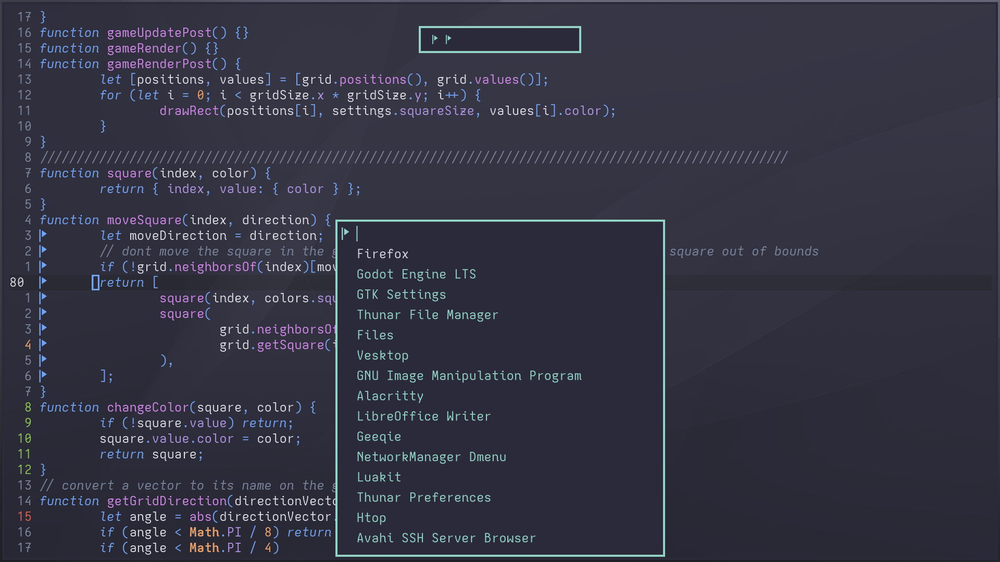
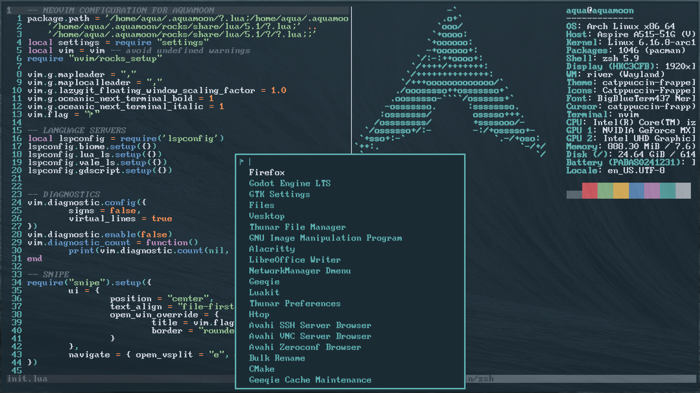
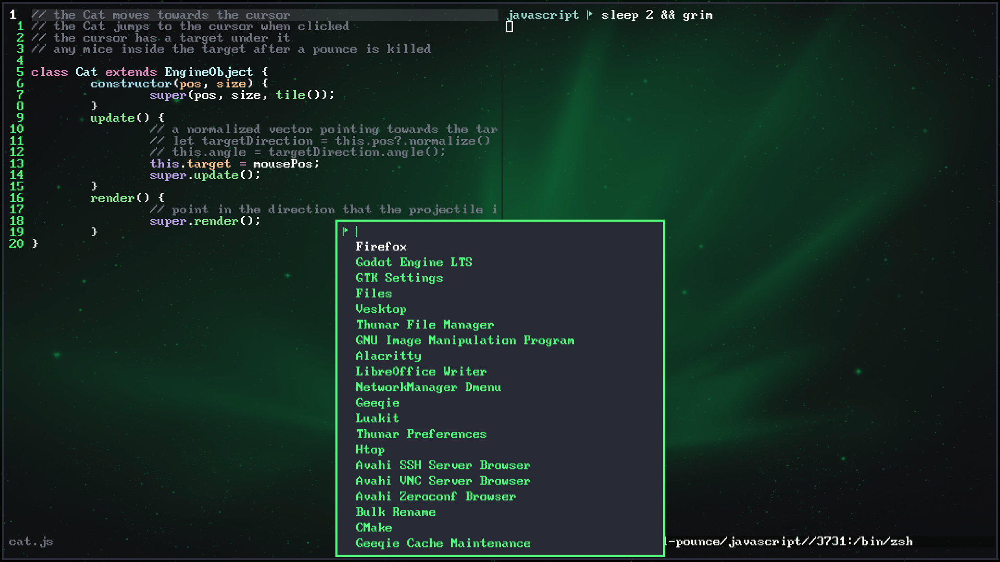

# AQUAMOON CONFIGURATION
## An Arch Linux desktop environment configured with Lua 

# SOFTWARE
|||
|:---------|:---------|
| Windows | River+Luatile |
| Menus | Tofi |
| Notifications | Dunst |
| Editor+Terminal | Neovide |
| Shell | Zsh |

# SCREENSHOTS
## Sweetie

## Oceanic

## Dracula

