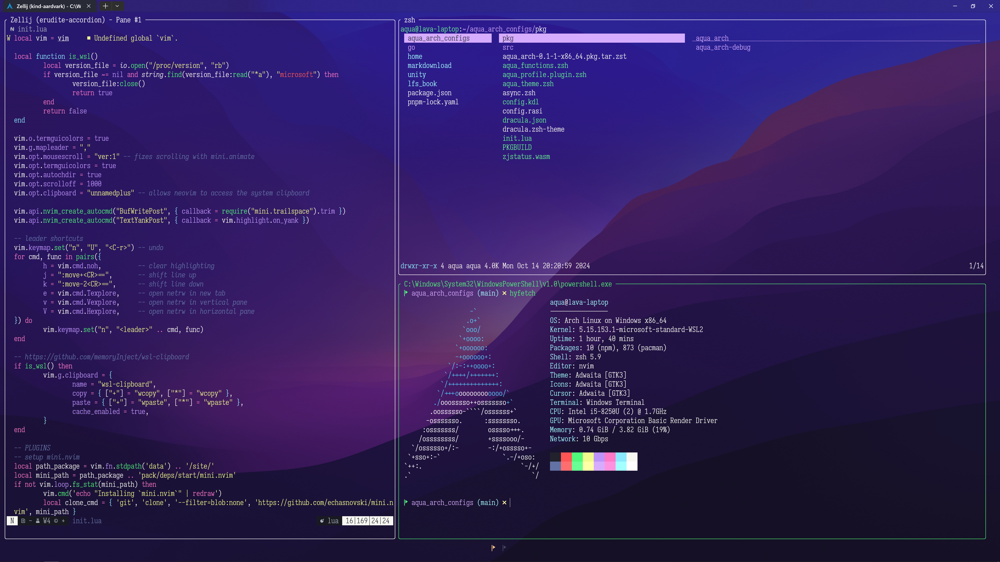

# Aqua Arch

### TEXT: NEOVIM
 - I use almost all of the *mini.nvim* packages.
 - Language servers are downloaded and managed by *mason*.
 - Completions are done with *blink.cmp* because it is fast and simple to configure.
 - I avoid having too many plugins by using terminal user interfaces with *toggleterm*.

### SHELL: ZSH
 - I navigate files with *lf*.
 - I manage git repositories with *lazygit*.
 - I write notes and save snippets with *nap*.
 - I like writing shell scripts with *gum*.

### TERMINAL: ZELLIJ
 - Minimal appearence using the *zjstatus* plugin.

### COLOR THEME: DRACULA
 - I use the *dracula* color scheme whenever possible.

### SCREENSHOTS

